# KSP Dominion Command OS
## Architecture Diagrams

These Mermaid diagrams are design references. Production diagrams must be updated when architecture decisions change.

---

# 1. System Context

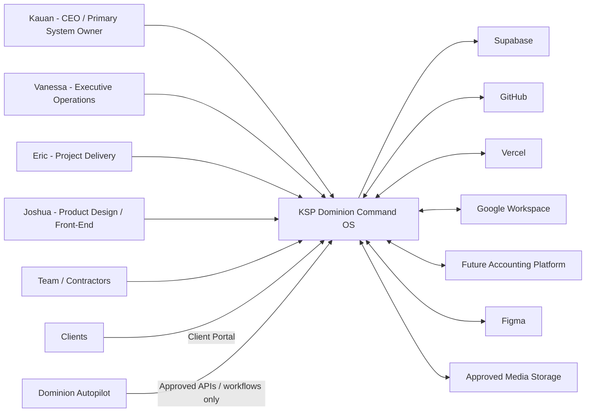

---

# 2. Command OS and Autopilot Boundary

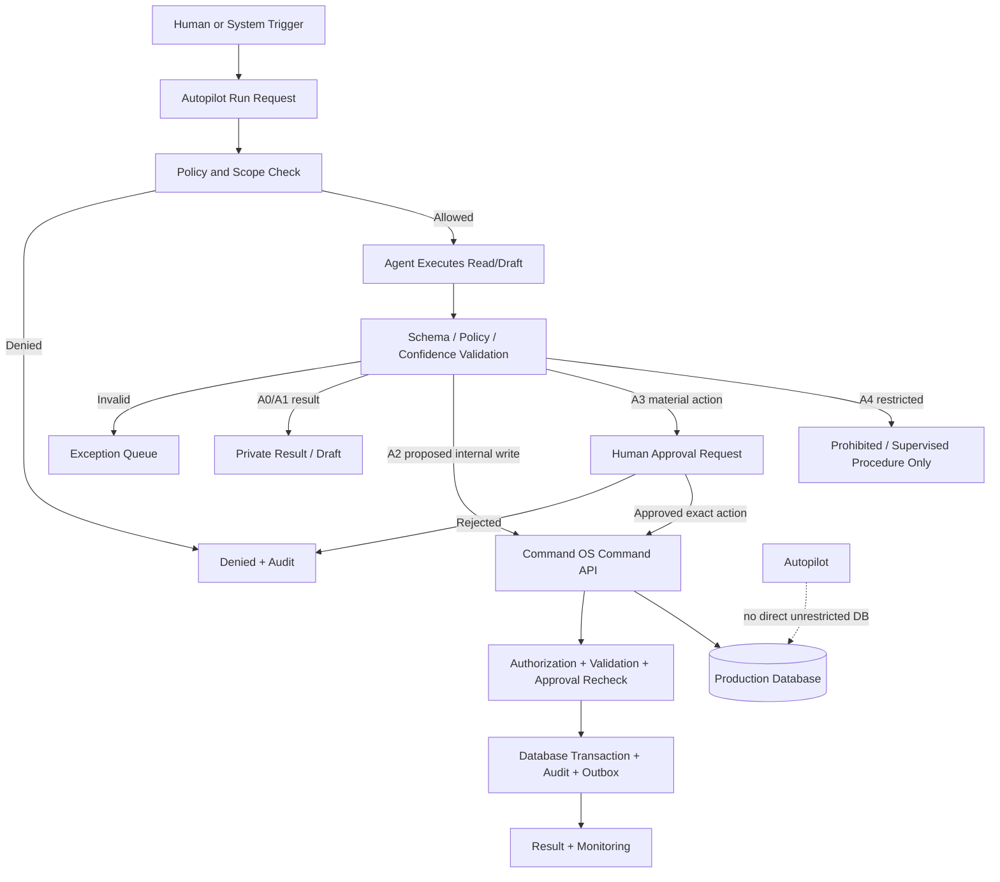

---

# 3. Application Containers

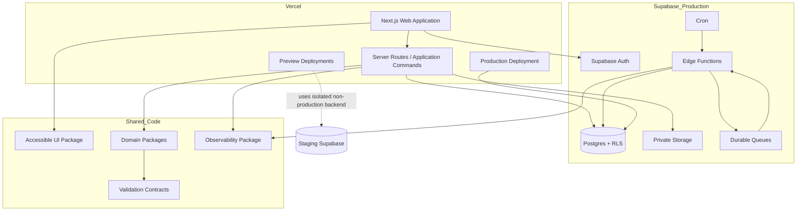

---

# 4. Authorization Decision

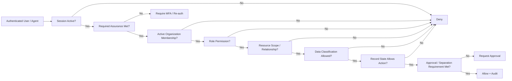

---

# 5. Client Portal Publication

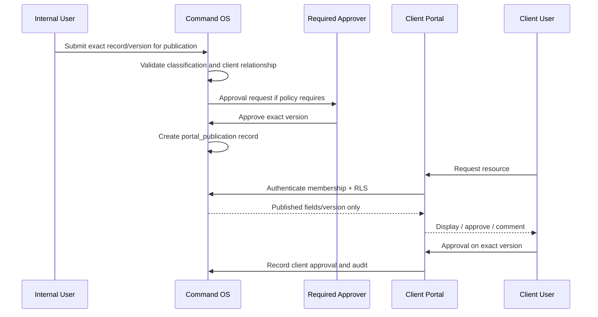

---

# 6. Financial Posting and Reconciliation

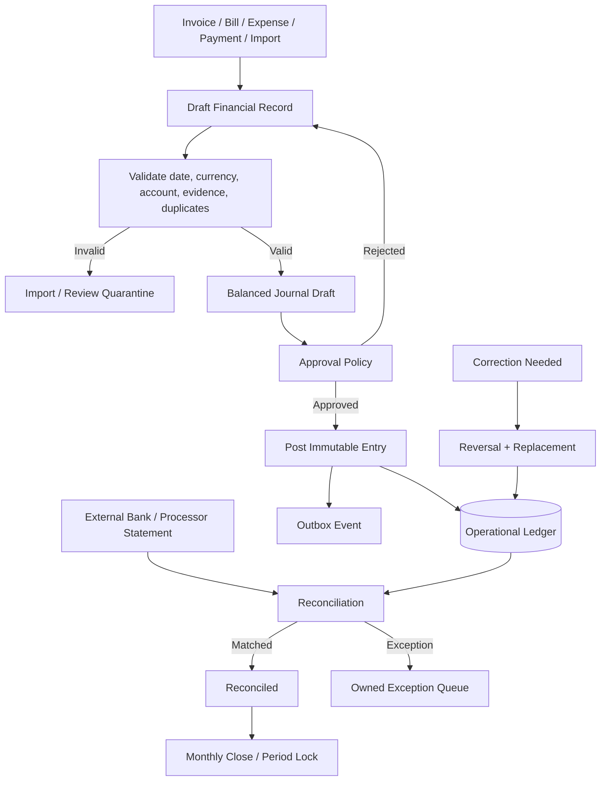

---

# 7. Creative Media Lifecycle

```mermaid
flowchart LR
    BRIEF[Approved Brief] --> PLAN[Script / Shot List / Call Sheet]
    PLAN --> READY{Releases, location, safety, crew, equipment ready?}
    READY -->|No| BLOCK[Blocked / Exception Approval]
    READY -->|Yes| CAP[Capture]
    CAP --> INGEST[Ingest Manifest + Checksum]
    INGEST --> BACKUP{Required copies verified?}
    BACKUP -->|No| BLOCK2[Do Not Delete Source Card]
    BACKUP -->|Yes| PROXY[Proxy / Edit Handoff]
    PROXY --> EDIT[Edit Version]
    EDIT --> REVIEW[Immutable Review Version + Timecoded Feedback]
    REVIEW --> QC[Technical / Content / Rights QC]
    QC --> APPROVE[Client / Internal Approval]
    APPROVE --> MASTER[Master + Derivatives]
    MASTER --> DELIVER[Delivery / Publication Evidence]
    DELIVER --> ARCHIVE[Archive / Retention / Rights Monitoring]
```

---

# 8. Software Delivery Pipeline

```mermaid
flowchart LR
    REQ[Requirement + Acceptance Criteria] --> ISSUE[Issue / Task Contract]
    ISSUE --> BRANCH[Isolated Branch / Worktree]
    BRANCH --> BUILD[Human / Claude / Codex / Jules Implementation]
    BUILD --> LOCAL[Local Checks]
    LOCAL --> PR[Pull Request]
    PR --> CI[CI: lint, type, unit, DB, RLS, integration, e2e, a11y, security]
    CI -->|Fail| BUILD
    CI -->|Pass| PREVIEW[Vercel Preview]
    PREVIEW --> REVIEW[CODEOWNERS + Domain QA]
    REVIEW -->|Changes| BUILD
    REVIEW -->|Approve| MERGE[Protected Merge]
    MERGE --> STAGING[Staging Deploy + Release Acceptance]
    STAGING --> PRODAPP[Production Approval]
    PRODAPP --> PROD[Production Deploy]
    PROD --> HEALTH[Health + Business Control Checks]
    HEALTH -->|Fail| ROLLBACK[Rollback / Disable / Forward Fix]
    HEALTH -->|Pass| CLOSE[Release Evidence Closed]
```

---

# 9. Environment Isolation

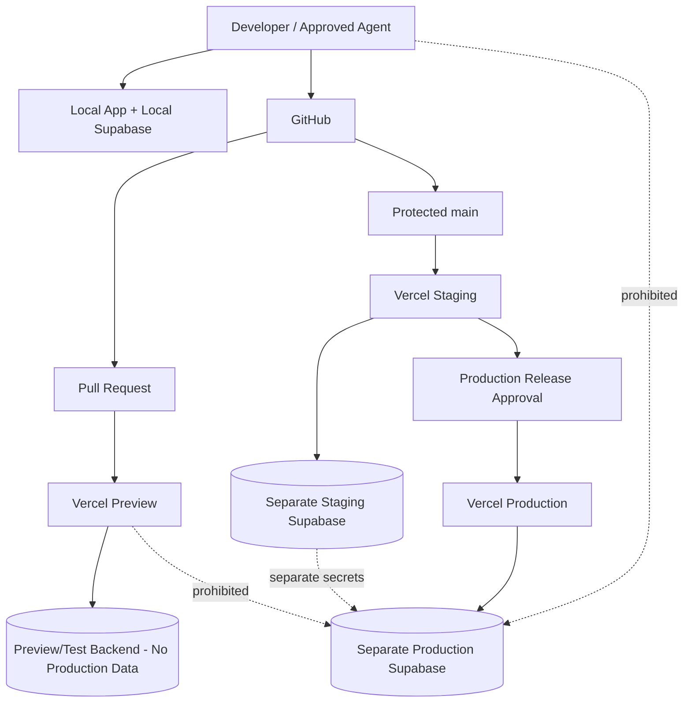

---

# 10. Migration Pipeline

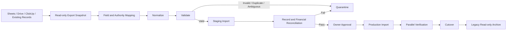

---

# 11. Executive Information Flow

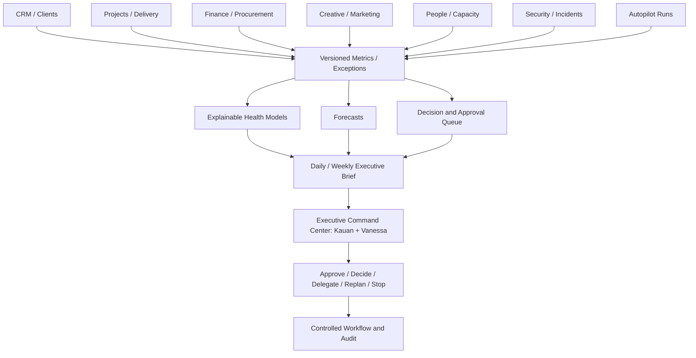
