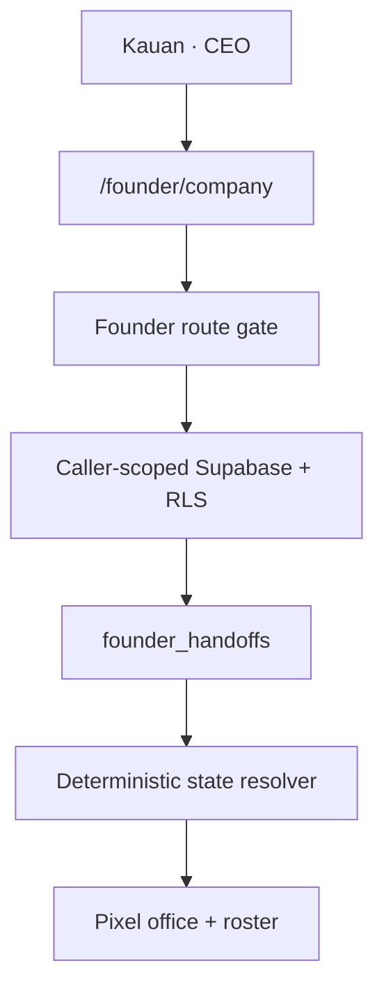

# Founder AI Company — Vertical Slice 1

**Status:** implementation ready for review  
**Date:** 2026-08-26  
**Route:** `/founder/company`  
**Authority:** Founder OS authorization and privacy model in `02_ARCHITECTURE_DECISION.md`, `04_SECURITY_MODEL.md` and `07_SECOND_BRAIN_AND_MCP.md`.

## Decision

The KSP AI Company is an additive Founder OS module, not another application, authentication system or database. It reuses:

- the existing Supabase Auth password/session;
- the `/founder/*` `founder_ceo` route gate;
- caller-scoped Supabase access and founder-only RLS;
- `founder_handoffs` as the first real work signal;
- the current KSP INC Onyx/Paper/Signal visual foundation.

Vanessa's `executive_operations` access to the KSP INC owner plane does not grant access to this founder-private module. The route remains restricted to `founder_ceo` because the requested surface is “for me.”

## Vertical slice shipped

- One CEO desk for Kauan Paiva, explicitly labeled human final authority.
- Seven departments with 11 AI-role records each.
- Exactly 77 agent roles across the requested hierarchy:
  - 7 `SUPER ULTRA` C-Level roles;
  - 7 `SUPER` Director roles;
  - 14 `ULTRA` Leader roles;
  - 14 `AGENT` Manager roles;
  - 35 `Subagent` Employee roles.
- Pixel-office map built with application CSS and semantic HTML; no image or game-engine dependency.
- Department roster with codename, title, hierarchy, mandate and live work state.
- Work state derived from real `founder_handoffs` rows:
  - `claimed` → working;
  - `ready` or `draft` → queued;
  - `blocked` → blocked;
  - `done` within 24 hours → completed recently;
  - otherwise → idle / no authorized work.
- Honest runtime boundary: a catalog role is not presented as a running model process.
- Navigation entry under Founder OS → Agents.

## Data flow

The first slice performs reads only. It adds no migration, service-role path, provider token, schedule or production mutation.

## Runtime truth contract

The office distinguishes a role from an executor:

1. **Role** — responsibility, hierarchy and mandate in the 77-record catalog.
2. **Job** — a bounded objective represented initially by a Founder Handoff.
3. **Executor** — ChatGPT/Codex, Claude Code, Jules, Gemini, a local model, deterministic code or a human operator.
4. **Run** — one claimed execution with timestamps, lease, result and evidence.
5. **Presence** — visual state computed from runs/jobs, never a decorative animation.

No connector is considered active merely because its name is listed in the blueprint.

## Verification evidence

- Agent registry tests: exact count, unique identifiers, seven departments, hierarchy distribution and parent integrity.
- State tests: idle, mismatched target, queued, blocked, claimed and 24-hour completion boundary.
- Founder navigation regression tests updated for `/founder/company`.
- Command TypeScript check passed.
- Command production build passed and emitted dynamic route `/founder/company` at 912 B route size / 107 kB first load JS in the local evidence run.
- Existing build warnings about the observability package using `process.stdout` in an Edge import trace remain unrelated to this slice.

## Next controlled PR train

1. AI Company schema: departments, agents, connectors, jobs, runs, schedules, leases, approvals, budgets and events with founder-only owner-bound RLS.
2. Runtime registry and connector health without storing plaintext credentials.
3. Idempotent 30-minute deterministic planner using Supabase Cron; it may create/triage jobs but must not claim LLM work without an authenticated executor.
4. Claude Code subscription-OAuth GitHub Action lane with explicit repository and branch allowlists.
5. Jules official connector lane; manual-only while “no API key” is a hard constraint.
6. GitHub PR and Vercel Preview evidence ingestion.
7. Retry/dead-letter/lease recovery and zero-cost budget circuit breaker.
8. Browser, keyboard, reduced-motion and responsive visual verification under a real founder session.

Production migrations, provider activations and production deploys require separate explicit approval.
