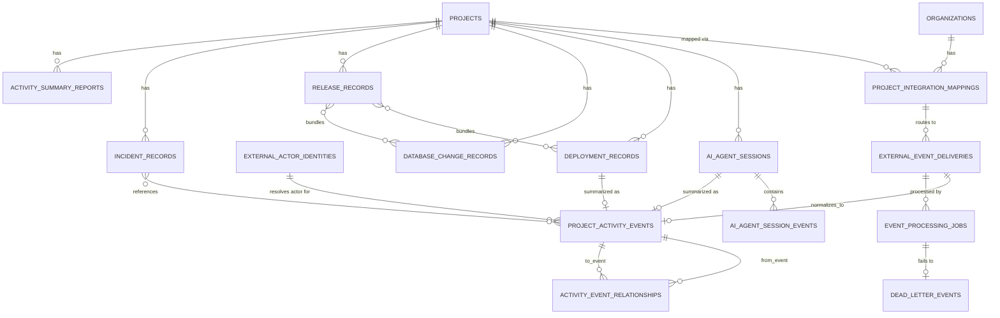

# 04 — Data Model

Status: **Complete** (conceptual — no migrations created) · 2026-07-23

All tables below are **conceptual drafts**, expressed in the repo's own naming conventions (snake_case, `organization_id` first FK, `created_at timestamptz`). No migration file has been created — this is Phase 1 planning input for whichever future phase actually builds the Hub. Every table follows the "ship RLS in the same migration that creates the table" lesson from `00_CURRENT_SYSTEM_AUDIT.md` §28 (the 7-times-repeated bug from the recent UI rebuild).

**Existing tables evaluated for reuse first** (per the assignment's explicit instruction not to duplicate adequate models):
- `integration_connections` — **reuse as-is** for coarse provider-connection status (already has `provider`, `scopes`, `token_expires_at`, `status`, `metadata`); extend with new `provider` values (`github`, `vercel`, `supabase_management`) rather than a new table.
- `activity_events` — **extend**, not replace, for the normalized event feed (see 04.4 below).
- `ai_actions` — **reuse the concept, do not reuse the table verbatim.** It has no write policy and no `session_id`/provider-neutral shape; propose `ai_agent_sessions`/`ai_agent_session_events` as its proper successor (04.7/04.8) and mark `ai_actions` itself for deprecation once the new tables ship, rather than leaving two overlapping "AI activity" tables live simultaneously.
- `background_jobs` — **reuse the concept for `event_processing_jobs`** (04.13) rather than inventing an unrelated second queue-table concept; if `background_jobs`'s existing shape is adequate once inspected at implementation time, extend it instead of creating a new table.
- `comments`, `notifications` — unrelated to this data model, no change needed.

## Entity-relationship diagram

---

## 04.1 `project_integration_mappings`

- **Purpose**: maps a KSP project to external provider resources via stable IDs.
- **Ownership**: Activity Hub module.
- **Tenant boundary**: `organization_id`.
- **PK**: `id uuid`.
- **FKs**: `organization_id → organizations`, `project_id → projects`.
- **Important fields**: `provider text` (`github`/`vercel`/`supabase`/`claude_code`/`codex`/`mcp`), `external_org_id text`, `external_repo_id text` (GitHub numeric repo ID, not full name), `external_project_id text` (Vercel project ID / Supabase project ref), `is_default boolean`, `environment text` (`production`/`preview`/`staging`), `task_id_prefix text`, `cost_center_label text`, `disconnected_at timestamptz`.
- **Constraints**: `unique(project_id, provider, external_repo_id, environment) where disconnected_at is null` — allows historical (disconnected) duplicates, prevents live conflicting mappings.
- **Indexes**: `(provider, external_repo_id)`, `(project_id)`.
- **Retention**: indefinite (soft-deleted via `disconnected_at`, never hard-deleted — historical events must keep resolving).
- **RLS**: `organization_id in current_org_ids() and (is_executive(organization_id) or can_access_project(project_id))` for select; insert/update executive-or-project-manager-only (new `PermissionAction`, e.g. `integration.map`, evaluated in `12_OPEN_QUESTIONS_AND_DECISIONS.md`).
- **PII/secret classification**: internal — no tokens stored here (tokens live in `integration_connections`, unchanged).
- **Expected volume**: tens of rows per project, low write frequency.
- **Archival**: none needed at this volume.

## 04.2 `external_event_deliveries` (the "raw delivery" table)

- **Purpose**: durable, signature-verified copy of every inbound provider event before any normalization.
- **Ownership**: Activity Hub ingestion pipeline.
- **Tenant boundary**: resolved lazily — a raw delivery may arrive **before** project mapping succeeds, so `organization_id`/`project_id` are nullable here (populated once mapping resolves) — this table cannot require tenant scoping the way every other table in this repo does, because that's exactly the ambiguity it exists to hold until resolved.
- **PK**: `id uuid`.
- **FKs**: `organization_id → organizations` (nullable), `project_integration_mapping_id → project_integration_mappings` (nullable until mapped).
- **Important fields**: `provider text`, `provider_delivery_id text`, `event_type text`, `received_at timestamptz`, `signature_valid boolean`, `processing_status text` (`pending`/`processing`/`normalized`/`failed`/`dead_lettered`), `retry_count int`, `redacted_payload jsonb`, `payload_hash text`, `retention_expires_at timestamptz`, `error_message text`, `project_mapping_result text` (`mapped`/`unmapped`/`ambiguous`).
- **Constraints**: `unique(provider, provider_delivery_id)` — the core idempotency/dedupe guarantee.
- **Indexes**: `(provider, provider_delivery_id)` (unique, doubles as lookup), `(processing_status, received_at)` for the retry/reconciliation worker, `(retention_expires_at)` for cleanup jobs.
- **Retention**: 1 year for GitHub/Vercel raw payloads, 90 days for Supabase (per `01_INTEGRATION_CAPABILITY_MATRIX.md`'s log-volume-conscious defaults) — see `06_SECURITY_PRIVACY_AND_TRUST.md`'s full retention matrix.
- **RLS**: **no direct end-user read policy at all** — this table is service-role/ingestion-pipeline-only (via the existing, currently-unused `createServiceClient()`, `00_CURRENT_SYSTEM_AUDIT.md` §6); the product surfaces only ever read `project_activity_events`, never this table, except an executive-only "raw delivery inspector" debug view for troubleshooting (a distinct, narrow read policy, not general access).
- **Insert authority**: service role only (the webhook ingest handler).
- **PII/secret classification**: `redacted_payload` must already have had known secret-shaped strings stripped (webhook signing secrets, tokens) before this insert — enforced in the ingestion code, not just documented; see `06_SECURITY_PRIVACY_AND_TRUST.md`.
- **Expected volume**: the highest-write-volume table in the whole model — see `10_OPERATIONS_AND_RUNBOOKS.md`/scale scenarios.
- **Archival**: hard-delete past `retention_expires_at` via a scheduled job; `payload_hash` retained even after payload deletion for a period, to support "was this exact event ever received" queries without keeping the full body.

## 04.3 `project_activity_events` (extends `activity_events`)

- **Purpose**: the single normalized, per-project event feed every UI screen queries.
- **Reuse decision**: **extend `activity_events` in place** rather than create a parallel table — add nullable columns for the new provider-sourced fields, and start populating the already-existing-but-unused `metadata jsonb` column (see `00_CURRENT_SYSTEM_AUDIT.md` §13's finding that `record()` never populates it today). New columns needed: `source_provider text default 'ksp_os'`, `event_family text`, `canonical_event_type text`, `provider_event_type text`, `severity text`, `correlation_id uuid`, `causation_id uuid`, `external_url text`, `visibility text default 'internal'`, `sensitivity_classification data_classification default 'internal'`, `external_event_delivery_id uuid references external_event_deliveries(id)`.
- **Ownership**: shared — Command app's existing `record()` call sites continue to write KSP-native events; the Hub's normalization worker writes provider-sourced events.
- **Tenant boundary**: `organization_id` (unchanged, already present).
- **Constraints**: none new beyond existing; `correlation_id`/`causation_id` are application-generated, not FK-enforced (they may point at concepts that don't have their own row, e.g. a correlation ID minted by the KSP AI Launcher before any event exists yet).
- **Indexes**: add `(organization_id, object_table, object_id, created_at)` for per-project-record timelines, `(source_provider, canonical_event_type)` for filtering.
- **Retention**: indefinite for the normalized row itself (this is the product-facing history — short raw-payload retention in 04.2 does not affect this table).
- **RLS**: unchanged from today's `activity_events` policy (already `organization_id`-scoped); no weakening.
- **PII/secret classification**: `summary`/`metadata` must themselves already be redacted before insert — same discipline as 04.2.
- **Expected volume**: grows with 04.2's normalization rate; indefinite retention means this needs a partitioning strategy at the "larger future" scale scenario (`10_OPERATIONS_AND_RUNBOOKS.md`).

## 04.4 `activity_event_relationships`

- **Purpose**: the event-relationship graph described in `03_CORRELATION_AND_PROVENANCE.md`.
- **PK**: `id uuid`. **FKs**: `organization_id`, `from_event_id → project_activity_events`, `to_event_id → project_activity_events`.
- **Important fields**: `relationship_type text` (`caused_by`/`belongs_to`/`triggers`/`references`/`promotes`/`reverses`/`contains`/`resolves`), `correlation_level int` (1/2/3, per the 3-level engine), `confidence_score numeric(4,3)` (null for Level 1/2, required for Level 3), `explanation text` (required for Level 3 — never store a bare score with no rationale).
- **Constraints**: `check (correlation_level in (1,2) or (correlation_level = 3 and confidence_score is not null and explanation is not null))` — enforces the "Level 3 must have an explanation" rule at the database level, not just in application code.
- **Indexes**: `(from_event_id)`, `(to_event_id)`.
- **RLS**: same visibility as the two events it connects — `exists` check against `project_activity_events` for both `from_event_id`/`to_event_id`.
- **Retention**: indefinite (small row, high value for reconstruction).

## 04.5 `external_actor_identities`

- **Purpose**: the actor-resolution model from `03_CORRELATION_AND_PROVENANCE.md`.
- **PK**: `id uuid`. **FKs**: `organization_id`, `profile_id → profiles` (nullable — unresolved actors have no KSP profile yet).
- **Important fields**: `provider text`, `provider_actor_id text`, `provider_username text`, `display_name text`, `actor_type text` (`ksp_user`/`github_user`/`vercel_user`/`supabase_member`/`claude_code_user`/`codex_user`/`chatgpt_user`/`service_account`/`github_app`/`automated_workflow`/`ai_agent`/`unknown`), `mapping_confidence text` (`verified`/`suggested`/`unknown`), `mapping_method text` (`email_match`/`oauth_identity`/`admin_confirmed`/`unresolved`), `confirmed_by uuid references profiles(id)` (nullable, set only for `admin_confirmed`).
- **Constraints**: `unique(provider, provider_actor_id)`.
- **RLS**: internal-member read; write restricted to the resolution worker (service role) for automatic `suggested` mappings, and to executives for `admin_confirmed` overrides.
- **Retention**: indefinite.

## 04.6 `ai_agent_sessions`

- **Purpose**: the provider-neutral AI session model from the PDF's "Unified AI session model" section.
- **PK**: `id uuid`. **FKs**: `organization_id`, `project_id → projects` (nullable), `task_id → tasks` (nullable), `initiating_profile_id → profiles`.
- **Important fields**: `provider text` (`claude_code`/`codex`/`claude_api`/`openai_api`/`chatgpt_mcp`), `product text`, `model text` (nullable — not always available per `01_INTEGRATION_CAPABILITY_MATRIX.md` C1/X1), `mode text` (`headless`/`interactive`/`hook_driven`), `external_session_id text` (the Claude Code session UUID or Codex thread/task ID — see C4/X6), `repository text`, `working_branch text`, `environment text`, `started_at timestamptz`, `ended_at timestamptz`, `status text` (`running`/`completed`/`failed`/`canceled`/`awaiting_approval`), `objective text`, `sanitized_summary text`, `permission_mode text`, `tools_allowed text[]`, `tools_used text[]`, `files_touched text[]`, `commands_summarized jsonb`, `tests_run jsonb`, `errors jsonb`, `commit_shas text[]`, `pull_request_urls text[]`, `deployment_ids uuid[]`, `token_usage jsonb`, `estimated_cost_usd numeric(10,4)`, `cost_confidence text` (`provider_reported`/`calculated_estimate`/`approximate`/`unknown` — per `01_INTEGRATION_CAPABILITY_MATRIX.md` C6/C11's estimate-vs-authoritative distinction), `approval_status text`, `canceled_by uuid references profiles(id)`.
- **Constraints**: `unique(provider, external_session_id)`.
- **Nullable-by-design**: per the PDF's explicit instruction, not every provider populates every field — `model`, `token_usage`, `estimated_cost_usd` are all nullable, with `cost_confidence` making clear whether an absence is "not applicable" or "not yet reconciled."
- **RLS**: assigned-project internal scope (same `can_access_project`/`is_executive` pattern as everything else) — see `02_PRODUCT_SCOPE.md`'s open question on whether AI Sessions need a narrower view than general project activity.
- **PII/secret classification**: `sanitized_summary`/`objective` must never contain full prompts or full assistant responses (per the PDF's explicit retention principles) — this is a data-shape rule enforced by the adapter that writes this table, not by the table itself.
- **Expected volume**: one row per AI session; moderate volume, much lower than raw events.
- **Archival**: none needed at KSP's scale; revisit if session volume grows materially.

## 04.7 `ai_agent_session_events`

- **Purpose**: the structured tool-use/progress event stream underlying a session (Claude Code hooks/stream-json, Codex `item.*`/`turn.*` events).
- **PK**: `id uuid`. **FK**: `ai_agent_session_id → ai_agent_sessions`.
- **Important fields**: `event_type text` (`tool_use`/`tool_result`/`file_change`/`command_execution`/`mcp_tool_call`/`error`/`turn_completed`), `occurred_at timestamptz`, `sanitized_detail jsonb` (tool name + file path + outcome, never full command output or full file diffs by default — see retention matrix), `sequence_number int`.
- **Constraints**: `unique(ai_agent_session_id, sequence_number)`.
- **RLS**: inherits the parent session's visibility (`exists` check against `ai_agent_sessions`).
- **Retention**: 90 days by default (this is the most granular, highest-volume AI-related data — matches the PDF's "avoid storing complete terminal sessions" principle); the session's own `sanitized_summary` on `ai_agent_sessions` outlives this detail table.
- **Deprecation note**: this table, together with `ai_agent_sessions`, is the intended successor to the existing unused `ai_actions` table (`00_CURRENT_SYSTEM_AUDIT.md` §13) — `ai_actions` should be formally deprecated (not silently ignored) once these ship, to avoid two overlapping "AI activity" concepts.

## 04.8 `deployment_records`

- **Purpose**: normalized Vercel (or future provider) deployment lifecycle, richer than a single activity-event row needs.
- **PK**: `id uuid`. **FKs**: `organization_id`, `project_id`, `project_integration_mapping_id`.
- **Important fields**: `provider text default 'vercel'`, `external_deployment_id text`, `environment text`, `status text`, `git_commit_sha text`, `git_branch text`, `pull_request_url text`, `created_by_actor_id uuid references external_actor_identities(id)`, `ai_agent_session_id uuid references ai_agent_sessions(id)` (nullable — set when Level 1/2 correlation ties a deployment to the session whose commit triggered it), `started_at`, `completed_at`, `preview_url text`, `production_url text`, `failure_summary text`, `promoted_from_deployment_id uuid references deployment_records(id)`.
- **Constraints**: `unique(provider, external_deployment_id)`.
- **RLS**: assigned-project internal scope.
- **PII/secret classification**: `failure_summary` is a summary, never a full build-log copy (per `01_INTEGRATION_CAPABILITY_MATRIX.md`'s explicit caution against unlimited log storage).
- **Expected volume**: one row per deployment — moderate.

## 04.9 `database_change_records`

- **Purpose**: normalized Supabase branch/migration lifecycle.
- **PK**: `id uuid`. **FKs**: `organization_id`, `project_id`, `project_integration_mapping_id`.
- **Important fields**: `provider text default 'supabase'`, `external_branch_ref text`, `change_type text` (`branch_created`/`migration_applied`/`migration_failed`/`branch_deleted`), `git_commit_sha text` (nullable — ties to the migration file's commit), `pull_request_url text`, `step_statuses jsonb` (the clone/pull/health/configure/migrate/seed/deploy DAG from `01_INTEGRATION_CAPABILITY_MATRIX.md` S5), `occurred_at timestamptz`, `failure_summary text`.
- **RLS**: assigned-project internal scope.
- **Expected volume**: low-moderate (one row per branch action run).

## 04.10 `release_records`

- **Purpose**: bundles multiple deployments/migrations/commits/tasks/AI-sessions into a single named release (Phase 6 concept, modeled now so later phases don't retrofit).
- **PK**: `id uuid`. **FKs**: `organization_id`, `project_id`.
- **Important fields**: `name text`, `environment text`, `released_at timestamptz`, `approved_by_profile_ids uuid[]`, `known_issues text`, `rollback_target_release_id uuid references release_records(id)`.
- **Join tables**: `release_deployments (release_id, deployment_record_id)`, `release_database_changes (release_id, database_change_record_id)` — many-to-many, since a release can bundle several of each.
- **RLS**: assigned-project internal scope.

## 04.11 `incident_records`

- **Purpose**: Phase 6 incident/rollback workflow.
- **PK**: `id uuid`. **FKs**: `organization_id`, `project_id`, `owner_profile_id → profiles`.
- **Important fields**: `severity text`, `status text` (`open`/`mitigated`/`resolved`), `affected_environment text`, `detection_source text`, `mitigation text`, `resolution text`, `opened_at`, `resolved_at`.
- **Join table**: `incident_related_events (incident_id, project_activity_event_id)` — links the incident to whatever events reconstruct its timeline.
- **RLS**: assigned-project internal scope; executives always included.

## 04.12 `event_processing_jobs`

- **Purpose**: the async normalization/retry queue's own job-state table (see `05_SYSTEM_ARCHITECTURE.md` for the queue-technology decision this depends on).
- **Reuse decision**: evaluate extending the existing, currently-unused `background_jobs` table first; propose this only if that table's actual shape (once inspected) proves inadequate.
- **Important fields**: `external_event_delivery_id → external_event_deliveries`, `status text` (`queued`/`processing`/`succeeded`/`failed`/`dead_lettered`), `attempt_count int`, `next_retry_at timestamptz`, `last_error text`.
- **RLS**: service-role only, no end-user access — this is pipeline-internal state, not a user-facing concept (though its aggregate counts feed the command center's "processing failures" widget via a read-only rollup view, not direct table access).

## 04.13 `dead_letter_events`

- **Purpose**: terminal-failure holding table after `event_processing_jobs` exhausts retries — never silently drop a failed event.
- **Important fields**: `external_event_delivery_id`, `failure_reason text`, `dead_lettered_at timestamptz`, `resolved_at timestamptz` (nullable — set when a human manually reprocesses or dismisses it), `resolved_by profile_id`.
- **RLS**: executive/operations-only read (this is an operational-health surface, not general activity).

## 04.14 `activity_summary_reports`

- **Purpose**: stored output of the weekly-report/summary workflow (`07_UX_INFORMATION_ARCHITECTURE.md`'s Reports section), so a generated report is a durable, re-viewable artifact rather than ephemeral.
- **Important fields**: `report_type text`, `project_id` (nullable — some reports are cross-project), `date_range_start`, `date_range_end`, `generated_by_profile_id`, `deterministic_metrics jsonb`, `narrative_summary text`, `source_event_ids uuid[]` (the evidence links every claim must trace back to), `published boolean`, `published_at timestamptz`.
- **RLS**: assigned-project internal scope, or executive-only for cross-project reports.
