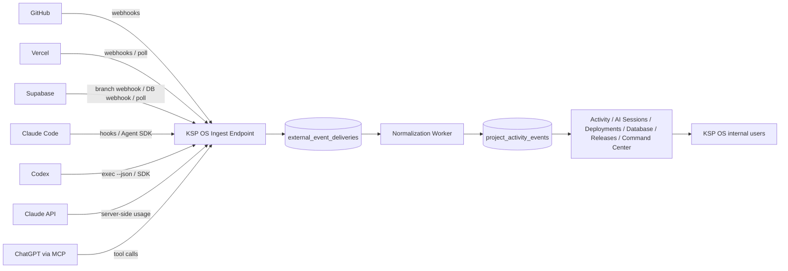
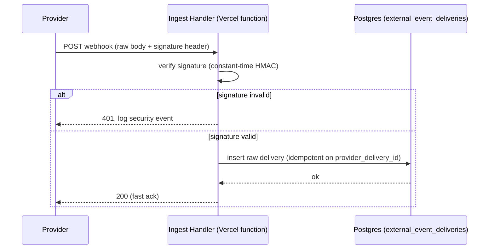
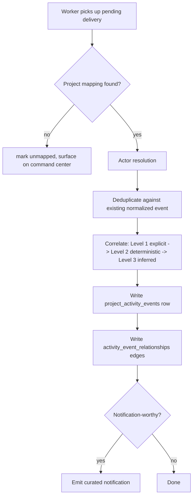
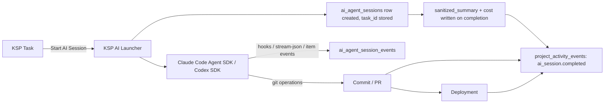
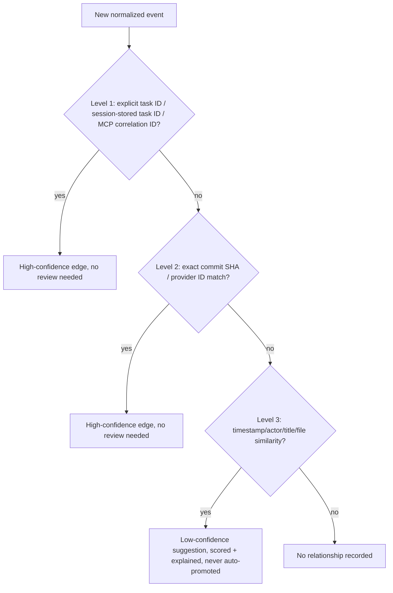
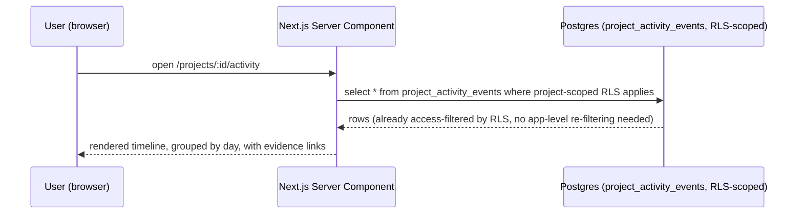
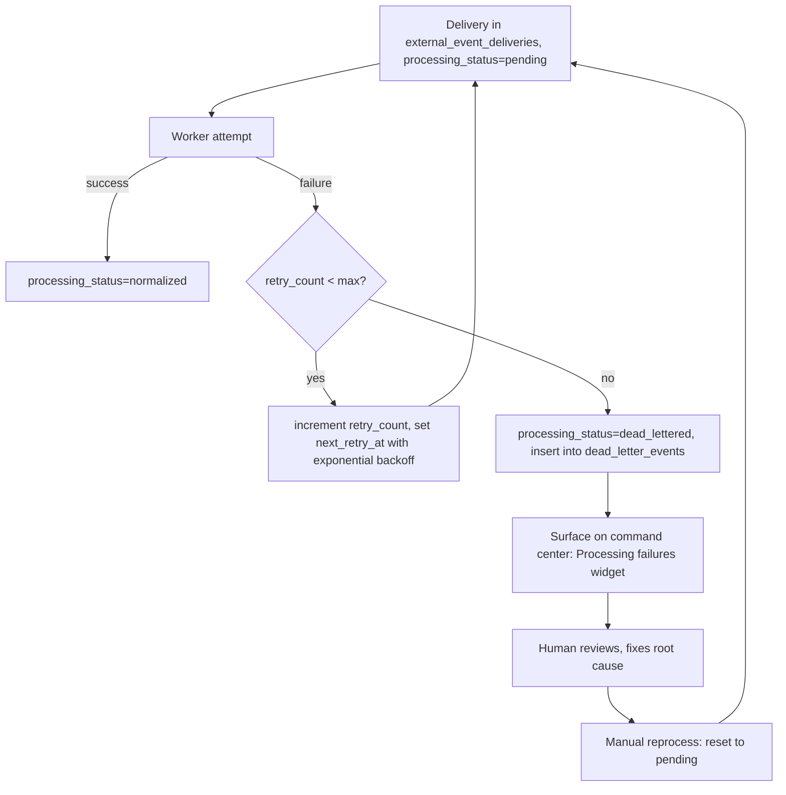

# 05 — System Architecture

Status: **Complete** (planning-only) · 2026-07-23

## Ingestion pipeline

```
Provider (GitHub/Vercel/Supabase/AI adapters)
  -> authenticated webhook or authorized poller
  -> signature/token validation
  -> raw delivery persistence (external_event_deliveries)
  -> fast acknowledgement (HTTP 200, before any normalization work)
  -> asynchronous normalization (queue-driven worker)
  -> project mapping (project_integration_mappings)
  -> actor resolution (external_actor_identities)
  -> deduplication (unique(provider, provider_delivery_id))
  -> correlation (activity_event_relationships, 3-level engine)
  -> normalized ledger event (project_activity_events)
  -> notification/reporting/read models
```

### Why "persist raw, then ack, then normalize async" is non-negotiable

Vercel serverless functions have hard execution-time limits and no persistent in-memory state between invocations. A webhook handler that tries to validate-and-fully-normalize-and-correlate synchronously before responding risks timing out under load (especially GitHub webhook bursts) and, more importantly, risks **losing an event entirely** if any step after signature validation throws — because nothing was durably stored yet. The architecture instead treats "durably write the raw, signature-verified delivery" as the only thing that must happen before returning 200. Everything after that (project mapping, actor resolution, correlation, ledger write) is retryable, replayable, and can fail independently without losing the underlying event — it's just a row in `external_event_deliveries` sitting in `processing_status = 'pending'` until a worker picks it up.

### Queue / job-processor: recommendation + fallback

**No queue infrastructure exists in this repo today** (`00_CURRENT_SYSTEM_AUDIT.md` §16) — introducing one requires an ADR per `reference/AGENTS.md`'s "no new service/queue/provider without documented need and, for material choices, an ADR" rule. See `adr/0004-queue-and-job-processor.md`.

**Recommended: `pgmq`** (Postgres-native message queue, available as a Supabase database extension) **+ a Vercel Cron-triggered worker route** that drains the queue on a short interval (e.g. every 1 minute, or as often as Vercel Cron allows on KSP's plan).

Why this over the alternatives evaluated:
- **Existing infrastructure**: runs entirely inside the Postgres database KSP-OS already has — no new vendor, no new connection string, no new operational surface to monitor. This is the strongest fit for the repo's own "modular monolith, no new service without documented need" governance rule.
- **Operational complexity**: minimal — it's SQL functions (`pgmq.send`, `pgmq.read`, `pgmq.archive`, `pgmq.delete`) callable from the same Supabase client the app already uses everywhere.
- **Durability**: backed by Postgres itself — exactly as durable as every other table in the system, no separate durability story to reason about.
- **Retry support**: built-in visibility-timeout semantics (a message becomes invisible to other readers for a configurable window after being read, and reappears if not archived/deleted in time — a natural at-least-once retry primitive).
- **Vercel compatibility**: works over the same Postgres connection Vercel functions already use; the "worker" is just another Vercel serverless function invoked by Vercel Cron, not a long-running process (which Vercel doesn't support anyway).
- **Local development**: works the same locally as in any environment, since it's just Postgres — no separate local queue service to run.
- **Vendor lock-in**: low — it's a Postgres extension with a documented SQL API, and the underlying `external_event_deliveries` table remains queryable directly even without it.

**Fallback: a plain polling table**. If `pgmq` proves unavailable (e.g., the extension isn't enabled on KSP's Supabase plan) or unnecessary at KSP's actual event volume, skip the queue abstraction entirely and have the Vercel Cron worker directly `select ... from external_event_deliveries where processing_status = 'pending' order by received_at limit N for update skip locked`, process each with manual retry-count/backoff columns already present in the table (04.2's `retry_count`), and mark `processing_status` accordingly. This is strictly simpler (one fewer moving part) at the cost of slightly cruder concurrency control (`for update skip locked` still prevents double-processing across concurrent workers, so this is a real, safe fallback, not a toy one).

**Recommendation for KSP right now, given the "Small: up to 10 active projects" scale scenario** (`10_OPERATIONS_AND_RUNBOOKS.md`): start with the plain polling fallback. It requires zero new extensions or dependencies, and at 10-project scale the event volume does not need `pgmq`'s visibility-timeout sophistication. Revisit `pgmq` if/when volume grows into the "Medium: up to 100 active projects" scenario. This sequencing itself is recorded as `adr/0004-queue-and-job-processor.md`.

### Cross-cutting reliability concerns

- **Raw-body preservation**: the webhook handler must read the raw request body *before* any JSON parsing, since signature validation (GitHub HMAC-SHA256, Vercel HMAC-SHA1) is computed over the raw bytes, not the parsed object — a framework that auto-parses JSON before your handler runs will break this unless explicitly configured to expose the raw body.
- **Fast acknowledgement**: target sub-second ack — the handler's only synchronous work is signature verification + one insert into `external_event_deliveries`.
- **Retry policy / exponential backoff**: on normalization failure, `retry_count` increments and `next_retry_at` (or the queue's native retry mechanism) backs off exponentially (e.g. 1m, 5m, 30m, 2h, then dead-letter) — capped, not infinite.
- **Dead-letter handling**: after a fixed attempt ceiling, a row moves to `dead_letter_events` (04.13) and surfaces on the command center — never silently retried forever, never silently dropped.
- **Reprocessing**: a dead-lettered or previously-unmapped event can be manually reprocessed once its root cause (e.g. a missing project mapping) is fixed — this re-enters the same pipeline from the `external_event_deliveries` row, not a special-cased code path.
- **Provider redelivery / duplicate deliveries**: the `unique(provider, provider_delivery_id)` constraint (04.2) makes re-ingestion of a genuine redelivery a no-op insert conflict, handled with `on conflict do nothing` (or `do update` to bump a `redelivery_count` counter, if that's useful signal).
- **Out-of-order events**: normalization must not assume delivery order matches occurrence order (e.g., a `deployment.succeeded` webhook could theoretically be processed before its `deployment.created` counterpart under retry/backoff conditions) — the normalization worker upserts by external ID rather than assuming a strict creation-then-update sequence.
- **Eventual consistency**: the UI must be built assuming a just-happened event may take up to the worker's polling interval to appear — no promise of synchronous consistency between "GitHub says this happened" and "it's visible in KSP OS."
- **Rate limits**: respected on the *outbound* side too (e.g., the REST-backfill/reconciliation jobs reading GitHub/Vercel/Supabase APIs must honor each provider's documented limits from `01_INTEGRATION_CAPABILITY_MATRIX.md`).
- **Provider outages / database outages**: a provider outage simply means no webhooks arrive — nothing to handle beyond the command center's own "no recent activity" staleness signal eventually flagging it. A KSP-side database outage means webhook handlers should fail *fast* and let the provider's own redelivery mechanism (GitHub: 3-day window; Vercel: undocumented, treat as unreliable) be the safety net for the outage's duration — this is exactly why raw persistence, not synchronous full processing, is the ack-gating step: a database write failure surfaces as a clean 5xx to the provider rather than a partial, inconsistent processing attempt.
- **Idempotency**: every processing step (project mapping, actor resolution, correlation, ledger write) must be safely re-runnable against the same raw delivery without creating duplicate normalized events — enforced via upsert semantics keyed on `external_event_delivery_id`.
- **Monitoring**: see `10_OPERATIONS_AND_RUNBOOKS.md` for the specific metrics this pipeline must expose.
- **Replay safety**: replaying an already-normalized event must be a safe no-op (same idempotency guarantee as above), not a duplicate ledger entry.
- **Schema evolution / payload versioning**: `redacted_payload` in `external_event_deliveries` is stored as `jsonb` specifically so a provider's payload-shape change doesn't require a migration to keep receiving events — only the *normalization* logic (application code) needs updating when a provider changes its schema, and old raw deliveries remain queryable in their original shape.

## Diagrams

### System context



### Webhook ingestion



### Event normalization



### AI session flow



### Correlation flow



### User-facing timeline query



### Failure and retry flow


